# Research report for: Scene Representation Networks

Results of research.

## 1. Dataset: Shepard Metzler
### 1.1 Overfit on subset
**Target:** overfit model on small subset of data in order to see how behave losses, scores, gradients.

**Results:**

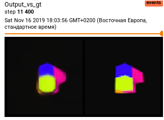
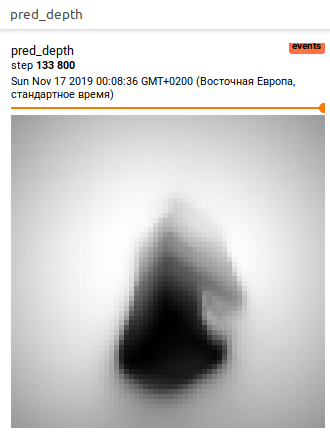
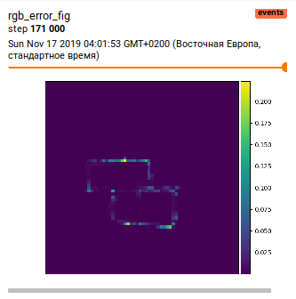
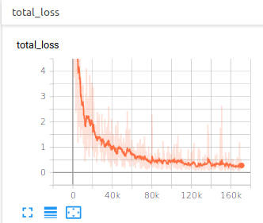

### 1.2 Train on whole dataset
**Target:** meet with problems during training models on large 3D dataset.

**Results:**

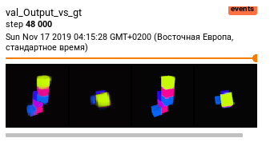
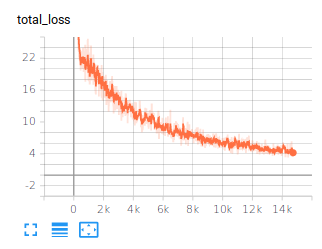
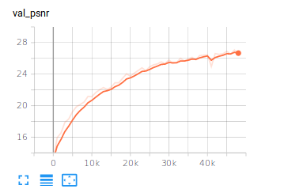

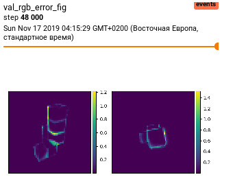

---

## 2. Dataset: Custom

Training is in progress...

### 2.1 Train on whole dataset
**Target:** look how model perfor 3D mapping in more complex environment.

**Results:**

- If compare with training on whole Shepard Metzler dataset it is obvious that training is less stable. It's probably because here is less images and more complex environment. Possible solution: increase dataset and increase size of models.
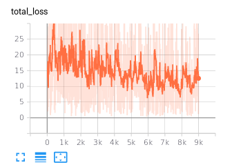
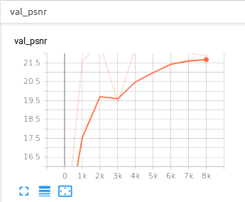
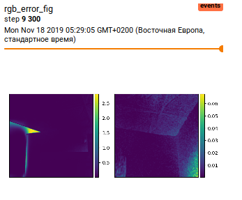
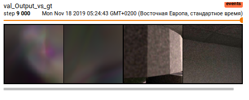

